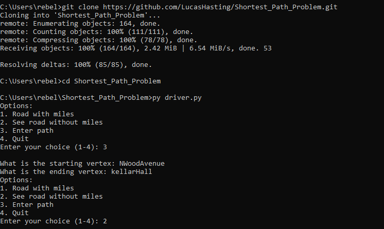
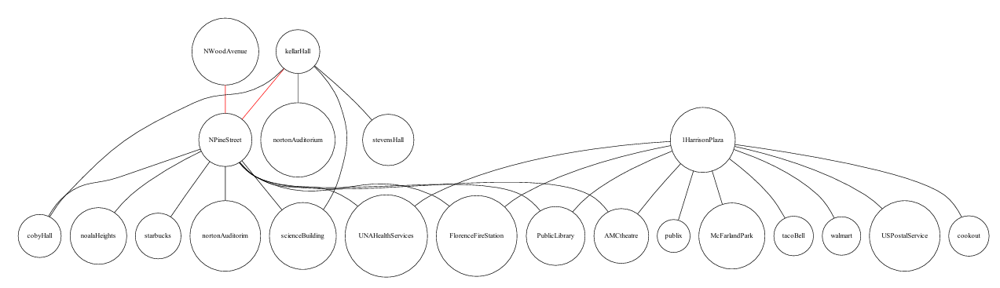
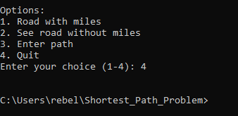

# Shortest Path Problem
This was the final project of CS 355 (Data Structures and Algorithms). The project was done with the help of Ethan Nix and Krutivas Pradhan.  

The program gets nodes with weight (representing miles) from a text file. Then, program will turn that text file into a graph. Also, you can view the graph at any time. You are able to select 2 points on the graph and the program uses Dijkstra's Algorithm to find the shortest path. The program then highlights the shortest path red.  

## Table of Contents

- [Installation](#installation)
- [Usage](#usage)
- [Example](#example)
- [Program-Overview](#program-overview)

## Installation

You need [Python](https://www.python.org/downloads/) installed on your system. This project requires a few pip package, run the following to install them (after installing python): 
```sh
pip install graphviz
```

```sh
pip install heapq
```

### Option 1: using [git](https://git-scm.com/downloads)
1. Clone the repository:

    ```sh
    git clone https://github.com/LucasHasting/Shortest_Path_Problem.git
    ```

2. Navigate to the project directory and execute the program:

    ```sh
    cd Shortest_Path_Problem
    py driver.py
    ```
### Option 2: without git
1. Download the project as a zip file
2. [Extract the zip file](https://www.wikihow.com/Unzip-a-File)
3. In windows, the subnetting.py file can be clicked to execute

#### Run from the command line
1. Find the location of the files
2. Copy the path
3. go to the command line and run the following:
   ```sh
   cd /path/to/files
   py driver.py
   ```

## Usage
The program is a command line, menu based, user interface. By entering the number associated with an option it will perform a certain operation. The first item displays the road (graph) with the miles included and the second item displays the road without the miles. The third option allows you to enter a path (starting point and destination), while the 4th and last option allows you to exit/quit the program.

When selecting a path it will ask for a starting vertex which is the starting point, then it will ask for a destination vertix which is the destination. It will then bring back the main menu and choosing either of the first two options will show the path highlighted red.

When selecting either of the first two options, the program will generate a pdf of the road (graph) and will try to open software that can view the pdf (such as google chrome).

## Example

  
  
  

## Program-Overview
[driver.py](https://github.com/LucasHasting/Shortest_Path_Problem/blob/main/driver.py): contains the main driver of the program and is what needs to be executed.   
[file_conversion.py](https://github.com/LucasHasting/Shortest_Path_Problem/blob/main/file_conversion.py): contains an object used for converting a graph file in txt format to dot format which is used by graphviz, this file also calculates the shortest path between two nodes.  
[extra_functions.py](https://github.com/LucasHasting/Shortest_Path_Problem/blob/main/extra_functions.py): contains extra functions used in the driver.  
[Test_Plan.txt](https://github.com/LucasHasting/Shortest_Path_Problem/blob/main/Test_Plan.txt): contains the road(graph) information, it is formatted as source,destination,miles.
[Shortest Path Problem.pptx](): The presentation given in class.
